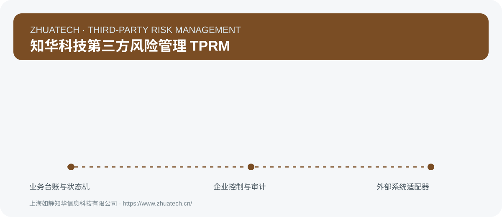

# ZhuaTech Tprm｜知华科技第三方风险管理 TPRM

> 从准入到退出持续识别第三方带来的业务与合规风险

[](backend/pom.xml)
[](frontend/package.json)
[](compose.yaml)
[](LICENSE)

<p align="center"></p>

## 第三方全周期风险视图

TPRM 不止做一次准入问卷，而是持续管理风险证据、整改和合作退出。

ZhuaTech Tprm 是知华科技（**上海如静知华信息科技有限公司**）维护的前后端分离企业应用社区源码版。产品、实施与技术服务信息请访问[知华科技官网](https://www.zhuatech.cn/)。

## 已实现业务域

| 代码 | 模块 | 可用能力 |
| --- | --- | --- |


全部模块共享可用的台账新增、查询、草稿修改、删除、受控状态流、风险标记、责任人与期限管理，不是静态菜单占位。

## 核心闭环

```text

```

服务端校验动作的前置状态，禁止越级流转；创建、修改、删除、审批、设置变更、附件与外部回执均写入审计日志。

## 领域规则引擎

固有风险、控制有效性、剩余风险、重大问题与证据完整度评估。

- 接口：`POST /api/enterprise/tprm/assess-risk`
- 输入使用 Bean Validation 做必填、范围与格式校验
- 输出包含计算指标、阻断原因、预警和明确决策
- 相关的正常、异常和边界场景均有 MockMvc 集成测试

## 企业控制底座

- 组织与期间维度的控制事项、逾期和状态统计
- 幂等键防止网络重试产生重复单据
- 经办人与管理员职责分离，管理员接口单独授权
- 附件仅登记 SHA-256、大小、介质类型与存储键，办结前强制凭证齐备
- JPA 乐观锁保护并发更新，外部适配器回执可追踪
- 生产 profile 会拒绝默认密码、空数据库密码和 localhost 跨域配置
- 健康检查、统一异常响应、输入校验与最近 100 条操作审计
- 组合检索、分页、SLA/逾期看板、责任人负荷与 UTF-8 CSV 导出
- 单据详情、协作备注和按业务编号聚合的完整操作时间线
- 流程动作标注 `OPERATOR/ADMIN` 所需角色，服务端强制校验审批权限
- 预留 SRM、合同系统、外部风险数据与通知平台 的适配器边界，不包含任何真实密钥

详细控制项、接口和上线边界见[企业版说明](docs/ENTERPRISE.md)。

## 技术与目录

```text
frontend/        Vue 3 + Vite 响应式业务工作台
backend/         Java 21 + Spring Boot 4 + Security + JPA
docs/            API、架构、企业能力和测试说明
compose.yaml     MySQL 8 + Backend + Nginx 一键编排
```

Java 工程包：`cn.zhuatech.tprm`。前端默认端口：`8308`。

## 启动与验收

```bash
cp .env.example .env
# 修改全部默认密码后启动
docker compose up --build
```

本地质量检查：

```bash
mvn -f backend/pom.xml test
npm ci --prefix frontend
npm run build --prefix frontend
docker compose config
```

演示账号仅用于本机体验：`admin / admin123`、`operator / operator123`。生产环境必须启用 `prod` profile，并通过环境变量传入独立强密码和受控跨域域名。

配套文档：[API](docs/API.md) · [架构](docs/ARCHITECTURE.md) · [测试](docs/TESTING.md) · [安全政策](SECURITY.md) · [贡献指南](CONTRIBUTING.md)

## 使用与商业授权

本工程仅允许个人非商业性的学习、研究和技术交流，**不得商用**。商用、SaaS、企业部署、二次销售、软件实施和深度定制须事先取得上海如静知华信息科技有限公司书面授权。

咨询中小企业信息化、AI 转型、OPC 技术支持、软件外包、FDE 外包及项目实施，请访问[https://www.zhuatech.cn/](https://www.zhuatech.cn/)或扫描微信二维码。

<p align="center">&nbsp;&nbsp;</p>

SEO：TPRM系统、第三方风险、供应商风险、尽职调查、持续监控、知华科技、上海软件开发、企业信息化、软件项目外包。
